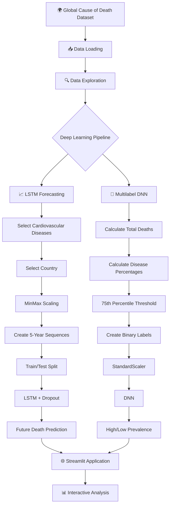
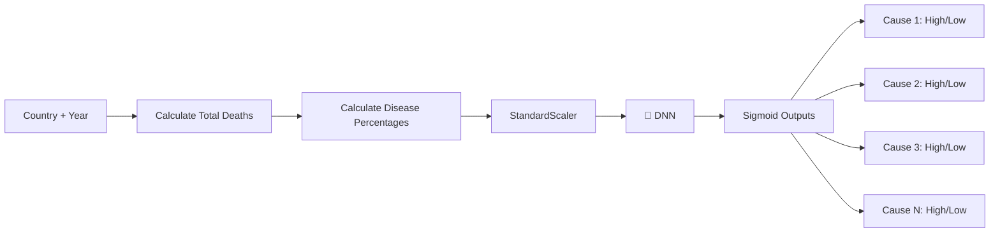
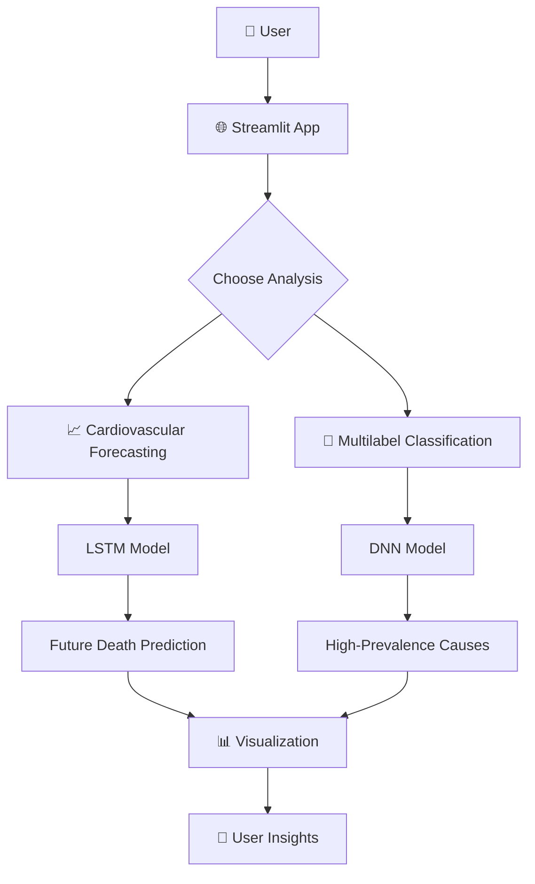

# 🌍 Cause of Deaths Around the World — Deep Learning Analysis

<p align="center">
  
  
  
  
  
</p>

<p align="center">
  <strong>🌍 A Deep Learning system for analysing global causes of death through time-series forecasting and multilabel classification.</strong>
</p>

---

## 📌 Overview

**Cause of Deaths Around the World** is an end-to-end Deep Learning project that analyses worldwide mortality data and applies two different neural-network approaches:

### 🧠 Model 1 — LSTM Forecasting

Predicts future **Cardiovascular Disease deaths** using historical time-series data.

### 🤖 Model 2 — Multilabel DNN Classification

Classifies country-year observations according to whether different causes of death have **high prevalence**, using disease-level percentage features.

Both models are integrated into a single **Streamlit application** for interactive analysis.

---

# 🎯 Project Objectives

The project focuses on two major questions:

### 1️⃣ Time-Series Forecasting

> Can historical cardiovascular disease mortality patterns be used to forecast future deaths?

### 2️⃣ Multilabel Classification

> Can a Deep Neural Network identify causes of death with high prevalence for a country-year observation?

---

# 🧠 System Architecture



---

# 🔄 Complete Data Pipeline

```text
🌍 Global Mortality Dataset
          ↓
📥 Load Data
          ↓
🔍 Data Inspection
          ↓
🧹 Feature Engineering
          ↓
       ┌──┴──┐
       ↓     ↓
   LSTM      DNN
   Pipeline  Pipeline
       ↓     ↓
 Forecast  Multilabel
       ↓     ↓
       └──┬──┘
          ↓
    🌐 Streamlit App
          ↓
    📊 Predictions
```

---

# 📊 Dataset

The project uses the Kaggle dataset:

**Cause of Deaths Around the World**

The notebook downloads the dataset using:

```python
import kagglehub

path = kagglehub.dataset_download(
    "iamsouravbanerjee/cause-of-deaths-around-the-world"
)
```

The main dataset used is:

```text
cause_of_deaths.csv
```

The dataset contains country-level and year-level information for multiple causes of death.

Key identifying columns include:

```text
Country/Territory
Code
Year
```

The remaining disease-related columns are used for analysis and modelling.

---

# 📈 Model 1 — Cardiovascular Disease Forecasting

## 🎯 Objective

The first Deep Learning model focuses on:

```text
Cardiovascular Diseases
```

The notebook initially visualizes cardiovascular-disease mortality trends for:

```text
🇺🇸 United States
🇮🇳 India
🇨🇳 China
🇬🇧 United Kingdom
🇦🇫 Afghanistan
```

The forecasting model itself is initially built for:

```text
United States
```

---

# ⏳ Time-Series Preparation

The model uses historical data to create sequential training examples.

### Sequence Length

```text
5 years → Predict next year
```

For example:

```text
1990
1991
1992
1993
1994
 ↓
1995 prediction
```

Then:

```text
1991
1992
1993
1994
1995
 ↓
1996 prediction
```

This allows the LSTM to learn temporal relationships.

---

# ⚖️ Min-Max Scaling

The cardiovascular disease data is normalized using:

```python
MinMaxScaler()
```

This converts the data into a normalized numerical range suitable for neural-network training.

The scaler is saved as:

```text
scaler_cardiovascular.pkl
```

---

# 🧠 LSTM Architecture

The forecasting model uses:

```text
Input Sequence
      ↓
LSTM — 50 Units
      ↓
Dropout — 20%
      ↓
Dense — 1
      ↓
Predicted Death Count
```

### Model

```python
model = Sequential([
    LSTM(
        50,
        activation='relu',
        input_shape=(5, 1)
    ),

    Dropout(0.2),

    Dense(1)
])
```

---

# ⚙️ LSTM Training

The model uses:

| Parameter        | Value              |
| ---------------- | ------------------ |
| Architecture     | LSTM               |
| LSTM Units       | 50                 |
| Activation       | ReLU               |
| Dropout          | 20%                |
| Optimizer        | Adam               |
| Loss             | Mean Squared Error |
| Epochs           | Up to 100          |
| Batch Size       | 16                 |
| Validation Split | 20%                |
| Early Stopping   | Yes                |
| Patience         | 10                 |
| Sequence Length  | 5 years            |

---

# 🛑 Early Stopping

The LSTM uses:

```python
EarlyStopping(
    monitor='val_loss',
    patience=10,
    restore_best_weights=True
)
```

This helps prevent unnecessary training and restores the best-performing weights.

---

# 📊 LSTM Evaluation

The notebook evaluates the forecasting model using:

### MSE

```text
Mean Squared Error
```

### RMSE

```text
Root Mean Squared Error
```

The predictions are transformed back to the original scale using the saved `MinMaxScaler`.

The notebook also generates an:

```text
Actual Deaths vs Predicted Deaths
```

comparison plot.

---

# 🤖 Model 2 — Multilabel Classification

## 🎯 Objective

The second Deep Learning model classifies multiple causes of death simultaneously.

Instead of predicting a single class, the model produces multiple binary outputs.

Conceptually:

```text
Country + Year
      ↓
Disease Features
      ↓
┌──────────────────────────────┐
│ Cardiovascular → High / Low  │
│ Cancer        → High / Low   │
│ Respiratory   → High / Low   │
│ Diabetes      → High / Low   │
│ ...                          │
└──────────────────────────────┘
```

---

# 🧮 Feature Engineering

The notebook first identifies disease columns by excluding:

```text
Country/Territory
Code
Year
```

Then it calculates:

```text
Total Deaths
```

for each country-year observation.

For every disease:

```text
Disease Percentage =
Disease Deaths / Total Deaths
```

These percentages become the classification features.

---

# 🏷️ Label Creation

The project defines **high prevalence** using the 75th percentile of each disease's actual death count.

Conceptually:

```text
Disease Deaths > 75th Percentile
             ↓
         Label = 1
```

Otherwise:

```text
Label = 0
```

This creates multiple binary labels for each observation.

---

# 🧠 DNN Architecture

The multilabel classifier uses a feed-forward Deep Neural Network:

```text
Input
  ↓
Dense — 128
ReLU
  ↓
Dense — 64
ReLU
  ↓
Output Layer
Sigmoid
  ↓
Multiple Disease Labels
```

### Architecture

```python
input_layer = Input(
    shape=(X_train_scaled_clf.shape[1],)
)

hidden1 = Dense(
    128,
    activation='relu'
)(input_layer)

hidden2 = Dense(
    64,
    activation='relu'
)(hidden1)

output_layer = Dense(
    y_train_clf.shape[1],
    activation='sigmoid'
)(hidden2)
```

---

# ⚙️ DNN Configuration

| Parameter         | Value                     |
| ----------------- | ------------------------- |
| Model             | Deep Neural Network       |
| Task              | Multilabel Classification |
| Hidden Layer 1    | 128 neurons               |
| Hidden Layer 2    | 64 neurons                |
| Activation        | ReLU                      |
| Output Activation | Sigmoid                   |
| Optimizer         | Adam                      |
| Learning Rate     | 0.001                     |
| Loss              | Binary Crossentropy       |
| Epochs            | Up to 50                  |
| Batch Size        | 32                        |
| Validation Split  | 20%                       |
| Early Stopping    | Yes                       |
| Patience          | 10                        |

---

# 📊 Classification Metrics

The DNN is evaluated using:

* **Binary Accuracy**
* **Precision**
* **Recall**
* **Binary Crossentropy Loss**

```python
dnn_model.evaluate(
    X_test_scaled_clf,
    y_test_clf
)
```

---

# 🔄 Multilabel Prediction Flow



---

# 💾 Saved Model Artifacts

The project saves the trained models and preprocessing objects.

### LSTM

```text
lstm_cardiovascular_model.h5
```

### LSTM Scaler

```text
scaler_cardiovascular.pkl
```

### Multilabel DNN

```text
dnn_multilabel_classifier.h5
```

### Classification Scaler

```text
scaler_multilabel.pkl
```

These files allow the Streamlit application to load the trained models without retraining them.

---

# 🌐 Streamlit Application

The project combines both Deep Learning models into one application titled:

```text
🌍 Cause of Deaths Analysis: Forecasting & Classification
```

The Streamlit application loads:

```text
LSTM Model
      +
LSTM Scaler
      +
DNN Model
      +
DNN Scaler
```

and provides an interactive interface for analysing the data.

---

# 🖥️ Application Architecture



---

# 🛠️ Technology Stack

<p align="center">
  
</p>

| Technology      | Purpose                   |
| --------------- | ------------------------- |
| 🐍 Python       | Core development          |
| 🧠 TensorFlow   | Deep Learning             |
| 🔥 Keras        | Neural Networks           |
| 📊 Pandas       | Data manipulation         |
| 🔢 NumPy        | Numerical computing       |
| 📈 Matplotlib   | Visualization             |
| 🎨 Seaborn      | Statistical visualization |
| 🤖 Scikit-learn | Scaling & evaluation      |
| 🌐 Streamlit    | Interactive application   |
| 💾 Joblib       | Scaler serialization      |
| 📦 KaggleHub    | Dataset download          |

---

# 📁 Project Structure

```text
📦 Cause-of-Deaths-Around-the-World
│
├── 📓 Cause_of_Deaths_around_the_World.ipynb
│
├── 🌐 app.py
│
├── 🧠 lstm_cardiovascular_model.h5
├── 🧠 dnn_multilabel_classifier.h5
│
├── ⚙️ scaler_cardiovascular.pkl
├── ⚙️ scaler_multilabel.pkl
│
├── 📄 requirements.txt
├── 📖 README.md
│
└── 📁 assets
    ├── 🖼️ app-preview.png
    ├── 📈 cardiovascular-trends.png
    ├── 📊 actual-vs-predicted.png
    └── 🧠 architecture.png
```

---

# 🚀 Installation

Clone the repository:

```bash
git clone https://github.com/YOUR_USERNAME/Cause-of-Deaths-Around-the-World.git
```

Navigate to the project:

```bash
cd Cause-of-Deaths-Around-the-World
```

Install dependencies:

```bash
pip install -r requirements.txt
```

---

# 📦 Requirements

```text
numpy
pandas
scikit-learn
tensorflow
keras
matplotlib
seaborn
streamlit
joblib
kagglehub
```

---

# ▶️ Run the Streamlit Application

```bash
streamlit run app.py
```

The application will launch in your browser.

---

# 📊 Example Workflow

```text
🌍 Select Country
       ↓
📅 Select Historical Period
       ↓
❤️ Cardiovascular Disease Data
       ↓
🧠 LSTM
       ↓
📈 Forecast
```

And for classification:

```text
🌍 Country-Year Data
       ↓
🧮 Disease Percentages
       ↓
⚖️ Scaling
       ↓
🤖 DNN
       ↓
🏷️ Multiple High/Low Prevalence Labels
```

---

# 💡 Key Learning Outcomes

This project demonstrates practical experience with:

* Time-series forecasting
* LSTM neural networks
* Multilabel classification
* Deep Neural Networks
* Feature engineering
* Min-Max scaling
* Standardization
* Sequence generation
* Early stopping
* Model serialization
* Streamlit deployment
* Data visualization

---

# 🔮 Future Improvements

Potential improvements include:

* [ ] Forecast cardiovascular mortality for every country
* [ ] Multi-disease LSTM forecasting
* [ ] Multi-feature time-series forecasting
* [ ] Compare LSTM with GRU
* [ ] Add Transformer-based forecasting
* [ ] Improve multilabel threshold methodology
* [ ] Add SHAP explainability
* [ ] Interactive world map
* [ ] Country comparison dashboard
* [ ] Long-term mortality forecasting
* [ ] Automated model retraining
* [ ] Cloud deployment
* [ ] REST API
* [ ] Real-time health-data integration

---

# ⚠️ Important Note

The notebook demonstrates an analytical and educational modelling workflow.

The **75th-percentile threshold used for multilabel classification is a project-defined statistical threshold**, not a medical definition of disease severity or prevalence.

Similarly, LSTM forecasts should be treated as model-generated estimates rather than official epidemiological forecasts.

---

# 👨‍💻 Author

## Aravind

**AI & Data Science Student | Machine Learning | Deep Learning | Data Science**

<p align="center">
  <strong>Exploring real-world problems through data, mathematics and AI. 🌍🧠</strong>
</p>

---

# ⭐ Support the Project

If you find this project useful:

⭐ Star the repository
🍴 Fork the project
🐛 Report issues
💡 Suggest improvements
📢 Share it with others

---

<p align="center">

### 🌍 Data → 🧠 Deep Learning → 📈 Forecasting → 🤖 Classification → 📊 Insights

**Built with Python + TensorFlow + Streamlit 🚀**

</p>
